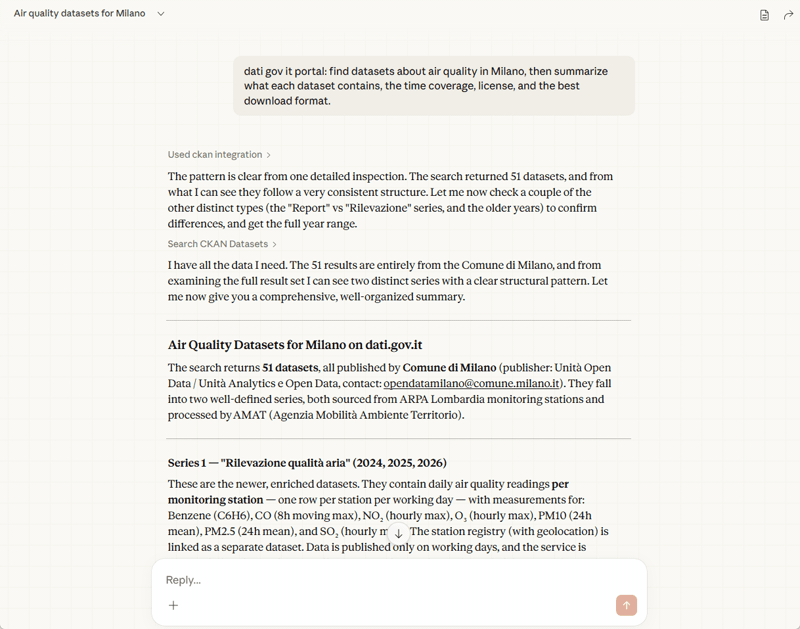

[](https://www.npmjs.com/package/@aborruso/ckan-mcp-server)
[](https://github.com/ondata/ckan-mcp-server)
[](https://deepwiki.com/ondata/ckan-mcp-server)
[](https://opensource.org/licenses/MIT)

# CKAN MCP Server

*Turn any (CKAN) open data portal into a conversation.*

**Give your AI assistant direct access to any CKAN open data portal — search datasets, explore organizations, query tabular data, and read metadata, all through natural language.**

CKAN is the open-source platform behind most public open data portals worldwide (Italy's dati.gov.it, the US data.gov, Canada's open.canada.ca, and many more). Navigating these portals usually requires knowing their structure, APIs, and search syntax. This MCP server removes that barrier: once connected, your AI tool can do it all for you.

**This is possible because of open standards and open source.** CKAN exposes a fully documented, public API. Metadata follows [DCAT](https://www.w3.org/TR/vocab-dcat/), an open W3C standard for describing datasets. Both are free to use, free to build on, and maintained by open communities. This server stands on that foundation.

**Who is this for?** Everyone. Journalists looking for data to verify a story. Researchers exploring public datasets. Public servants checking what data their administration publishes. Developers building data pipelines. No CKAN knowledge required.

**Two ways to use it — pick the one that suits you:**

| | Option A: Install locally | Option B: No install |
|---|---|---|
| **How** | `npm install -g @aborruso/ckan-mcp-server` | Point your tool to the hosted HTTP endpoint |
| **Best for** | Runs on your machine, works with any local tool | Quick start, zero setup |
| **Limits** | None | 100k requests/day shared quota |

Hosted endpoint: `https://ckan-mcp-server.andy-pr.workers.dev/mcp`

> **Recommendation**: Option B is a great way to get started and try things out without any setup. Once you're familiar with what the server can do, switching to Option A (local install) gives you unlimited usage with no shared quotas.

👉 Want to explore the codebase? The [**AI-generated DeepWiki**](https://deepwiki.com/ondata/ckan-mcp-server) is a great starting point.

**License**: MIT — see [LICENSE.txt](LICENSE.txt) for complete details. Third-party notices: [NOTICE.md](NOTICE.md).



---

## 🔌 Use it in your favorite tool

[ChatGPT](#chatgpt) | [Claude Desktop](#claude-desktop) | [Claude Code](#claude-code) | [Gemini CLI](#gemini-cli) | [VS Code](#vs-code) | [Codex CLI](#codex-cli)

This server works with any MCP-compatible client. The sections below cover some of the most popular ones — if your tool isn't listed, check its documentation for MCP configuration and use the same endpoint URL or command.

All examples below work with **both** the local installation and the hosted endpoint. Where both options differ, both are shown.

> **Using local installation?** You need to install the server first — see [Run locally](#run-locally).

### ChatGPT

> Requires a ChatGPT Plus, Team, or Enterprise plan.

1. Open the profile menu and go to **Settings → Apps → Advanced settings**
2. Enable **Developer mode**
3. Click **Create app** (top-right)
4. Fill in the form:
   - **Name:** CKAN MCP Server
   - **Description:** Search datasets on CKAN open data portals
   - **MCP Server URL:** `https://ckan-mcp-server.andy-pr.workers.dev/mcp`
   - **Authentication:** No Auth
   - Check the confirmation box, then click **Create**
5. In a new chat, click **+** → **More** and select **CKAN MCP Server**

> For a step-by-step walkthrough with screenshots, see the [full ChatGPT guide](https://github.com/ondata/ckan-mcp-server/blob/main/docs/guide/chatgpt/chatgpt_web.md).

### Claude Desktop

**Using the hosted endpoint (no install) — via connector UI:**

1. Open Claude Desktop and go to **Settings → Integrations**
2. Click **Add custom integration**
3. Fill in the details:
   - **Name:** CKAN MCP Server
   - **MCP Server URL:** `https://ckan-mcp-server.andy-pr.workers.dev/mcp`
4. Click **Add** to save
5. Open a new chat, click **+**, select **Integrations**, and enable **CKAN MCP Server**
6. When Claude asks to use a tool, click **Allow** (or **Always allow**)

> For a detailed walkthrough with screenshots, see the [full Claude guide](https://github.com/ondata/ckan-mcp-server/blob/main/docs/guide/claude/claude_web.md).

**Using the hosted endpoint (no install) — via config file:**

Configuration file location:

- **macOS**: `~/Library/Application Support/Claude/claude_desktop_config.json`
- **Windows**: `%APPDATA%\Claude\claude_desktop_config.json`
- **Linux**: `~/.config/Claude/claude_desktop_config.json`

```json
{
  "mcpServers": {
    "ckan": {
      "url": "https://ckan-mcp-server.andy-pr.workers.dev/mcp"
    }
  }
}
```

**Using local installation:**

```json
{
  "mcpServers": {
    "ckan": {
      "command": "npx",
      "args": ["@aborruso/ckan-mcp-server@latest"]
    }
  }
}
```

### Claude Code

**Using the hosted endpoint (no install):**

```bash
claude mcp add -s user -t http ckan https://ckan-mcp-server.andy-pr.workers.dev/mcp
```

**Using local installation:**

```bash
claude mcp add -s user ckan npx @aborruso/ckan-mcp-server@latest
```

> `--scope user` makes the server available globally across all your projects, not just the current one.

To add it only for a specific project, run from the project folder without the `--scope user` flag:

```bash
claude mcp add --transport http ckan https://ckan-mcp-server.andy-pr.workers.dev/mcp
```

### Gemini CLI

```bash
gemini mcp add -s user -t http ckan https://ckan-mcp-server.andy-pr.workers.dev/mcp
```

Or add manually to `~/.gemini/settings.json`:

```json
{
  "mcpServers": {
    "ckan": {
      "httpUrl": "https://ckan-mcp-server.andy-pr.workers.dev/mcp"
    }
  }
}
```

### VS Code

Add to your User Settings or `.vscode/settings.json`:

**Using the hosted endpoint (no install):**

```json
{
  "mcpServers": {
    "ckan": {
      "url": "https://ckan-mcp-server.andy-pr.workers.dev/mcp",
      "type": "http"
    }
  }
}
```

**Using local installation:**

```json
{
  "mcpServers": {
    "ckan": {
      "command": "npx",
      "args": ["@aborruso/ckan-mcp-server@latest"]
    }
  }
}
```

### Codex CLI

Add to `~/.codex/config.toml`:

**Using the hosted endpoint (no install):**

```toml
[mcp_servers.ckan]
url = "https://ckan-mcp-server.andy-pr.workers.dev/mcp"
```

**Using local installation:**

```toml
[mcp_servers.ckan]
command = "npx"
args = ["-y", "@aborruso/ckan-mcp-server@latest"]
```

---

## 🖥️ Run locally

### Option 1 — Install via npm

The quickest way. Install the package globally and it's immediately available as a command:

```bash
npm install -g @aborruso/ckan-mcp-server
```

The server will be available as `ckan-mcp-server`, or you can run it without installing via:

```bash
npx @aborruso/ckan-mcp-server@latest
```

### Option 2 — Clone and build

For development or if you want to run the latest unreleased code:

```bash
git clone https://github.com/ondata/ckan-mcp-server.git
cd ckan-mcp-server
npm install
npm run build
node dist/index.js
```

### Option 3 — Docker

Thanks to [@piersoft](https://github.com/piersoft), you can also run the server via Docker:

```bash
git clone https://github.com/ondata/ckan-mcp-server.git
cd ckan-mcp-server
docker compose up --build -d
```

The MCP server will be available at `http://localhost:3000/mcp`. See [`docker/README.md`](https://github.com/ondata/ckan-mcp-server/blob/main/docker/README.md) for full details, including how to connect Claude Desktop to the container.

---
## 🛠️ Available Tools

### Search and Discovery

- **ckan_package_search**: Search datasets with Solr queries
- **ckan_find_relevant_datasets**: Rank datasets by relevance score
- **ckan_package_show**: Complete details of a dataset
- **ckan_tag_list**: List tags with counts

### Organizations

- **ckan_organization_list**: List all organizations
- **ckan_organization_show**: Details of an organization
- **ckan_organization_search**: Search organizations by name

### Groups

- **ckan_group_list**: List groups
- **ckan_group_show**: Show group details
- **ckan_group_search**: Search groups by name

### DataStore

- **ckan_datastore_search**: Query tabular data
- **ckan_datastore_search_sql**: SQL queries on DataStore

### Quality Metrics

- **ckan_get_mqa_quality**: Get MQA quality score and metrics for dati.gov.it datasets (accessibility, reusability, interoperability, findability)
- **ckan_get_mqa_quality_details**: Get detailed MQA quality reasons and failing flags for dati.gov.it datasets

### Portal Discovery

- **ckan_find_portals**: Discover CKAN portals worldwide by country, language, or topic (uses datashades.info live registry of ~950 portals)

### Catalog Analysis

- **ckan_analyze_datasets**: Search datasets and inspect DataStore schemas of queryable resources
- **ckan_catalog_stats**: Statistical overview of a portal (totals, breakdown by category, format, organization)

### SPARQL

- **sparql_query**: Execute SPARQL SELECT queries against any public SPARQL endpoint

### Utilities

- **ckan_status_show**: Verify server status

---

## 📎 MCP Resource Templates

Direct data access via `ckan://` URI scheme:

- `ckan://{server}/dataset/{id}` - Dataset metadata
- `ckan://{server}/resource/{id}` - Resource metadata and download URL
- `ckan://{server}/organization/{name}` - Organization details
- `ckan://{server}/group/{name}/datasets` - Datasets by group (theme)
- `ckan://{server}/organization/{name}/datasets` - Datasets by organization
- `ckan://{server}/tag/{name}/datasets` - Datasets by tag
- `ckan://{server}/format/{format}/datasets` - Datasets by resource format (res_format + distribution_format)

Examples:

```
ckan://dati.gov.it/dataset/vaccini-covid
ckan://demo.ckan.org/resource/abc-123
ckan://data.gov/organization/sample-org
ckan://dati.gov.it/group/ambiente/datasets
ckan://dati.gov.it/organization/regione-toscana/datasets
ckan://dati.gov.it/tag/turismo/datasets
ckan://dati.gov.it/format/csv/datasets
```

---

## 💡 Usage Examples

### A natural language conversation

Once connected, just ask in plain language. No query syntax needed:

> *"Search dati.gov.it for datasets about air quality in Milan, then summarize what each contains — time coverage, license, and best download format."*

The server finds 31 datasets, groups them by structural pattern, and returns a clear summary — including series names, years covered, publisher, and format. No CKAN knowledge required.

---

The examples below show natural language requests alongside the actual tool call the LLM will generate internally and send to the CKAN portal. You never write these queries yourself — they are shown here **to illustrate how your question gets translated under the hood**.

### Search datasets (natural language: "search for population datasets")

```typescript
ckan_package_search({
  server_url: "https://www.dati.gov.it/opendata",
  q: "popolazione",
  rows: 20
})
```

### Force text-field parser for long OR queries (natural language: "find hotel or accommodation datasets")

```typescript
ckan_package_search({
  server_url: "https://www.dati.gov.it/opendata",
  q: "hotel OR alberghi OR \"strutture ricettive\" OR ospitalità OR ricettività",
  query_parser: "text",
  rows: 0  // returns only the total count, no dataset records — useful to check how many results match before fetching them
})
```

Note: when `query_parser: "text"` is used, Solr special characters in the query are escaped automatically.

### Rank datasets by relevance (natural language: "find most relevant datasets about urban mobility")

```typescript
ckan_find_relevant_datasets({
  server_url: "https://www.dati.gov.it/opendata",
  query: "mobilità urbana",
  limit: 5
})
```

### Filter by organization (natural language: "show recent datasets from Tuscany Region")

```typescript
ckan_package_search({
  server_url: "https://www.dati.gov.it/opendata",
  fq: "organization:regione-toscana",
  sort: "metadata_modified desc"
})
```

### Get statistics with faceting (natural language: "show statistics by organization, tags and format")

```typescript
ckan_package_search({
  server_url: "https://www.dati.gov.it/opendata",
  facet_field: ["organization", "tags", "res_format"],
  rows: 0  // skip dataset records, return only the facet counts
})
```

### List tags (natural language: "show top tags about health")

```typescript
ckan_tag_list({
  server_url: "https://www.dati.gov.it/opendata",
  tag_query: "salute",
  limit: 25
})
```

### Search groups (natural language: "find groups about environment")

```typescript
ckan_group_search({
  server_url: "https://www.dati.gov.it/opendata",
  pattern: "ambiente"
})
```

### DataStore Query (natural language: "query tabular data filtering by region and year")

> **What is DataStore?** CKAN DataStore is an optional extension that imports tabular resources (CSV, Excel) into a queryable database. It allows filtering, sorting, and field selection directly on the data — without downloading the file. Not all portals have it enabled, and not all datasets use it even when the portal supports it. Check `datastore_active: true` on a resource to confirm availability.

```typescript
// Ordinanze viabili del Comune di Messina — resource with datastore_active: true
ckan_datastore_search({
  server_url: "https://dati.comune.messina.it",
  resource_id: "17301b8b-2a5b-425f-80b0-5b75bb1793e9",
  filters: { "tipo": "lavori" },
  sort: "data_pubblicazione desc",
  limit: 10
})
```

> 👏 A shout-out to [Comune di Messina](https://dati.comune.messina.it/) and all public administrations that enable the DataStore extension: by doing so, they make their data dramatically easier to query and explore — including through AI tools like this one.

### DataStore SQL Query (natural language: "count road orders by type")

```typescript
// Count ordinanze viabili by tipo — Comune di Messina
ckan_datastore_search_sql({
  server_url: "https://dati.comune.messina.it",
  sql: "SELECT tipo, COUNT(*) AS total FROM \"17301b8b-2a5b-425f-80b0-5b75bb1793e9\" GROUP BY tipo ORDER BY total DESC LIMIT 5"
})
```

---

## 🌍 Supported CKAN Portals

Some examples of supported portals:

- 🇮🇹 **https://www.dati.gov.it/opendata** - Italian National Open Data Portal (CKAN 2.10.3)
- 🇺🇸 **https://catalog.data.gov** - United States Open Data (CKAN 2.11.4)
- 🇨🇦 **https://open.canada.ca/data** - Canada Open Government (CKAN 2.10.8)
- 🇦🇺 **https://data.gov.au** - Australian Government Open Data (CKAN 2.11.4)
- 🇬🇧 **https://data.gov.uk** - United Kingdom Open Data
- And many more portals worldwide

### Discover CKAN portals worldwide

[**Datashades.info/portals**](https://datashades.info/portals) maintains a live registry of ~950 CKAN portals from around the world, with metadata on version, plugins, dataset counts, and geographic coordinates. Thanks to [Sara Petti](https://www.linkedin.com/in/sara-petti-2795b5a0/) for bringing it to our attention.

The **`ckan_find_portals`** tool queries this registry directly. You can filter by country, language, minimum dataset count, or DataStore availability:

```
ckan_find_portals({ country: "Italy", has_datastore: true, limit: 5 })
ckan_find_portals({ language: "fr", min_datasets: 500 })
ckan_find_portals({ query: "transport" })
```

The portal data is also available as a public JSON API — no authentication required:

| Endpoint | Description |
|----------|-------------|
| `GET https://datashades.info/api/portal/list` | Full list of portals with CKAN version, plugins, dataset/resource/organization counts, and country coordinates |
| `GET https://datashades.info/api/portal/stats` | Aggregate statistics across all monitored portals |
| `GET https://datashades.info/api/portal/historical/stats` | Historical trend data for the monitored portals |

---

## 🔍 Advanced Solr Queries

CKAN uses [Apache Solr](https://solr.apache.org/) as its default search engine. Understanding Solr syntax unlocks the full power of dataset search — from simple keywords to complex boolean expressions, fuzzy matching, proximity searches, and date math.

### Basic syntax

```
# Basic search
q: "popolazione"

# Field search
q: "title:popolazione"
q: "notes:sanità"

# Boolean operators
q: "popolazione AND sicilia"
q: "popolazione OR abitanti"
q: "popolazione NOT censimento"

# Filters (fq) — single value
fq: "organization:comune-palermo"
fq: "tags:sanità"
fq: "res_format:CSV"

# Filters (fq) — OR on same field: use field:(val1 OR val2)
fq: "res_format:(CSV OR JSON)"
fq: "organization:(comune-palermo OR comune-roma)"

# ⚠️ Wrong OR syntax — silently ignored, returns entire catalog:
# fq: "res_format:CSV OR res_format:JSON"   ← DO NOT USE

# Filters on CKAN extras fields — use extras_ prefix
fq: "extras_hvd_category:\"http://data.europa.eu/bna/c_ac64a52d\""
fq: "extras_hvd_category:(\"http://data.europa.eu/bna/c_ac64a52d\" OR \"http://data.europa.eu/bna/c_dd313021\")"

# Wildcard
q: "popolaz*"

# Date range
fq: "metadata_modified:[2023-01-01T00:00:00Z TO *]"
```

### Advanced Query Examples

These real-world examples demonstrate powerful Solr query combinations tested on the Italian open data portal (dati.gov.it):

#### 1. Fuzzy Search + Date Math + Boosting (natural language: "find healthcare datasets modified in last 6 months")

Find healthcare datasets (tolerating spelling errors) modified in the last 6 months, prioritizing title matches:

```typescript
ckan_package_search({
  server_url: "https://www.dati.gov.it/opendata",
  q: "(title:sanità~2^3 OR title:salute~2^3 OR notes:sanità~1) AND metadata_modified:[NOW-6MONTHS TO *]",
  sort: "score desc, metadata_modified desc",
  rows: 30
})
```

**Techniques used**:

- `sanità~2` - Fuzzy search with edit distance 2 (finds "sanita", "sanitá", minor typos)
- `^3` - Boosts title matches 3x higher in relevance scoring
- `NOW-6MONTHS` - Dynamic date math for rolling time windows
- Combined boolean logic with multiple field searches

**Results**: 949 datasets including hospital units, healthcare organizations, medical services

#### 2. Proximity Search + Complex Boolean (natural language: "find air pollution datasets excluding water")

Environmental datasets where "inquinamento" and "aria" (air pollution) appear close together, excluding water-related datasets:

```typescript
ckan_package_search({
  server_url: "https://www.dati.gov.it/opendata",
  q: "(notes:\"inquinamento aria\"~5 OR title:\"qualità aria\"~3) AND NOT (title:acqua OR title:mare)",
  facet_field: ["organization", "res_format"],
  rows: 25
})
```

**Techniques used**:

- `"inquinamento aria"~5` - Proximity search (words within 5 positions)
- `~3` - Tighter proximity for title matches
- `NOT (title:acqua OR title:mare)` - Exclude water/sea datasets
- Faceting for statistical breakdown

**Results**: 305 datasets

#### 3. Wildcard + Field Existence + Date Math (natural language: "regional datasets with any format from last month")

Regional datasets published in the last month that have at least one resource format declared:

```typescript
ckan_package_search({
  server_url: "https://www.dati.gov.it/opendata",
  q: "organization:regione* AND metadata_created:[NOW-1MONTH TO *] AND res_format:*",
  sort: "metadata_modified desc",
  facet_field: ["organization"],
  rows: 10
})
```

**Techniques used**:

- `regione*` - Wildcard matches all regional organizations
- `res_format:*` - Field existence check (has at least one resource format declared)
- `NOW-1MONTH` - Rolling 30-day window

**Results**: 293 datasets

#### 4. Explicit Date Range + Facets (natural language: "Ministry of Labour datasets updated in 2025")

Datasets from the Italian Ministry of Labour modified during 2025, with facets by format and tags:

```typescript
ckan_package_search({
  server_url: "https://www.dati.gov.it/opendata",
  q: "organization:ministero-del-lavoro AND metadata_modified:[2025-01-01T00:00:00Z TO 2025-12-31T23:59:59Z]",
  sort: "metadata_modified desc",
  facet_field: ["res_format", "tags"],
  rows: 10
})
```

**Techniques used**:

- `[2025-01-01T00:00:00Z TO 2025-12-31T23:59:59Z]` - Explicit date range (full year)
- `organization:ministero-del-lavoro` - Filter by specific organization
- Multiple facets for format and topic breakdown

**Results**: 83 datasets

### Solr Query Syntax Reference

**Boolean Operators**: `AND`, `OR`, `NOT`, `+required`, `-excluded`
**Wildcards**: `*` (multiple chars), `?` (single char) - Note: left truncation not supported
**Fuzzy**: `~N` (edit distance), e.g., `health~2`
**Proximity**: `"phrase"~N` (words within N positions)
**Boosting**: `^N` (relevance multiplier), e.g., `title:water^2`
**Ranges**:

- Inclusive: `[a TO b]`, e.g., `num_resources:[5 TO 10]`
- Exclusive: `{a TO b}`, e.g., `num_resources:{0 TO 100}`
- Open-ended: `[2024-01-01T00:00:00Z TO *]`

**Date Math**: `NOW`, `NOW-1YEAR`, `NOW-6MONTHS`, `NOW-7DAYS`, `NOW/DAY`
**Field Existence**: `field:*` (field exists), `NOT field:*` (field missing)

---

## 📅 Understanding date fields

CKAN portals can be *source* catalogs (data published directly by the organization) or *harvesting aggregators* (data collected from many other portals). This distinction matters a lot when filtering by date.

| Field | Meaning on source portal | Meaning on aggregator |
|---|---|---|
| `issued` | When the publisher released the dataset | When the publisher released the dataset |
| `metadata_created` | When the record was first created | When the record was first harvested |
| `metadata_modified` | When the record was last updated | When the record was last re-harvested |

On an aggregator like `dati.gov.it`, `metadata_modified` is updated every time the portal re-harvests — even if the dataset content hasn't changed. This makes it unsuitable for finding "recently updated content".

**Example — same dataset, three different timestamps on dati.gov.it (aggregator):**

```json
{
  "issued": "2024-12-10",
  "metadata_created": "2024-12-16",
  "metadata_modified": "2026-02-28"
}
```

> `metadata_modified` is February 2026 only because the portal re-harvested it then — not because the data changed.

**Which date fields are filterable on dati.gov.it?**

All three fields are Solr-indexed and usable in queries:

| Field | Solr-indexed | What queries return |
|---|---|---|
| `issued` | ✅ | Datasets by publisher release date — most meaningful, but ~14% of datasets lack it |
| `metadata_created` | ✅ | Datasets by first harvesting date on dati.gov.it |
| `metadata_modified` | ✅ | Datasets by last re-harvesting date — often noisy |

**Query examples (dati.gov.it):**

```typescript
# Datasets about road accidents published by the original source in 2025
ckan_package_search({
  server_url: "https://www.dati.gov.it/opendata",
  q: "incidenti stradali",
  fq: "issued:[2025-01-01T00:00:00Z TO 2025-12-31T23:59:59Z]"
})
// → ~121 results (only datasets where publisher filled in `issued`)

# Datasets first appearing on dati.gov.it in 2025
ckan_package_search({
  server_url: "https://www.dati.gov.it/opendata",
  q: "incidenti stradali",
  fq: "metadata_created:[2025-01-01T00:00:00Z TO 2025-12-31T23:59:59Z]"
})
// → ~164 results (includes older datasets harvested for the first time in 2025)
```

> **Note on `issued` coverage**: ~59,700 of 69,000+ datasets on dati.gov.it have `issued` populated. Queries on `issued` are accurate but incomplete — datasets without the field are silently excluded. Prefer `issued` for content-date queries; use `metadata_created` only as a fallback for "when did this appear on the portal".

**Recommendation**: use `issued` to find datasets by publication date. Use `metadata_created` to find datasets that appeared on the portal recently.

---

## 👩‍💻 Developer Reference

### Project Structure

```
ckan-mcp-server/
├── src/
│   ├── index.ts            # Entry point
│   ├── server.ts           # MCP server setup
│   ├── worker.ts           # Cloudflare Workers entry
│   ├── types.ts            # Types & schemas
│   ├── utils/
│   │   ├── http.ts         # CKAN API client
│   │   ├── formatting.ts   # Output formatting
│   │   └── url-generator.ts
│   ├── tools/
│   │   ├── package.ts      # Package search/show
│   │   ├── organization.ts # Organization tools
│   │   ├── datastore.ts    # DataStore queries
│   │   ├── status.ts       # Server status
│   │   ├── tag.ts          # Tag tools
│   │   └── group.ts        # Group tools
│   ├── resources/          # MCP Resource Templates
│   │   ├── index.ts
│   │   ├── uri.ts
│   │   ├── dataset.ts
│   │   ├── resource.ts
│   │   └── organization.ts
│   ├── prompts/            # MCP Guided Prompts
│   │   ├── index.ts
│   │   ├── theme.ts
│   │   ├── organization.ts
│   │   ├── format.ts
│   │   ├── recent.ts
│   │   └── dataset-analysis.ts
│   └── transport/
│       ├── stdio.ts
│       └── http.ts
├── tests/                  # Test suite
├── dist/                   # Compiled output (generated)
├── package.json
└── README.md
```

### Build & Test

```bash
# Build (esbuild, ~4ms)
npm run build

# Watch mode
npm run watch

# Run all tests
npm test

# Watch mode for tests
npm run test:watch

# Coverage report
npm run test:coverage
```

### Explore with MCP Inspector

The [MCP Inspector](https://github.com/modelcontextprotocol/inspector) lets you browse tools, test calls interactively, and debug responses in a web UI:

```bash
npm install -g @modelcontextprotocol/inspector
npm run build
npx @modelcontextprotocol/inspector node dist/index.js
```

Opens at `http://localhost:5173`.

### Manual HTTP Testing

```bash
# Start server
TRANSPORT=http PORT=3001 node dist/index.js

# List available tools
curl -s -X POST http://localhost:3001/mcp \
  -H 'Content-Type: application/json' \
  -H 'Accept: application/json, text/event-stream' \
  -d '{"jsonrpc":"2.0","method":"tools/list","id":1}'

# Call a tool
curl -s -X POST http://localhost:3001/mcp \
  -H 'Content-Type: application/json' \
  -H 'Accept: application/json, text/event-stream' \
  -d '{
    "jsonrpc":"2.0","method":"tools/call",
    "params":{"name":"ckan_package_search","arguments":{"server_url":"https://www.dati.gov.it/opendata","q":"ambiente","rows":3}},
    "id":1
  }' | jq -r '.result.content[0].text'
```

### Portal View URL Templates

Some CKAN portals expose non-standard web URLs for viewing datasets or organizations. To support those cases, this project ships with [`src/portals.json`](src/portals.json), which maps known portal API URLs (and aliases) to custom view URL templates.

When generating a dataset or organization view link, the server:

- matches the `server_url` against `api_url` and `api_url_aliases` in [`src/portals.json`](src/portals.json)
- uses the portal-specific `dataset_view_url` / `organization_view_url` template when available
- falls back to the generic defaults (`{server_url}/dataset/{name}` and `{server_url}/organization/{name}`)

### Troubleshooting

**Wrong URL for Italian portal** — use `https://www.dati.gov.it/opendata` (not `https://dati.gov.it`).

**Connection error**

```
Error: Server not found: https://example.gov
```

Verify the URL is reachable and use `ckan_status_show` to confirm the portal is responding.

**No results** — broaden your query or check what's available with facets:

```typescript
ckan_package_search({
  server_url: "https://www.dati.gov.it/opendata",
  q: "*:*",
  facet_field: ["tags", "organization"],
  rows: 0
})
```

**LLM uses external data when no results are found** — when a tool returns no results, some LLMs (e.g. ChatGPT) may supplement the answer with information from their training data without warning. This is a known LLM behavior, not a server issue. To avoid it, instruct the model in your system prompt to only use data returned by the MCP tools and not rely on external sources.

---

## 🆘 Support

For issues or questions, [open an issue on GitHub](https://github.com/ondata/ckan-mcp-server/issues/new/choose).

---

## 🔗 Useful Links

- [CKAN](https://ckan.org/) — the open-source platform behind most public open data portals
- [CKAN API Documentation](https://docs.ckan.org/en/latest/api/) — full reference for the CKAN API v3
- [DCAT Vocabulary (W3C)](https://www.w3.org/TR/vocab-dcat/) — the metadata standard used by CKAN portals to describe datasets
- [MCP Protocol](https://modelcontextprotocol.io/) — Model Context Protocol specification

---

Created with ❤️ by [onData](https://ondata.it) for the open data community
