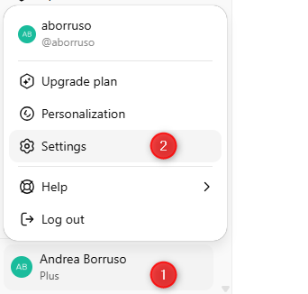
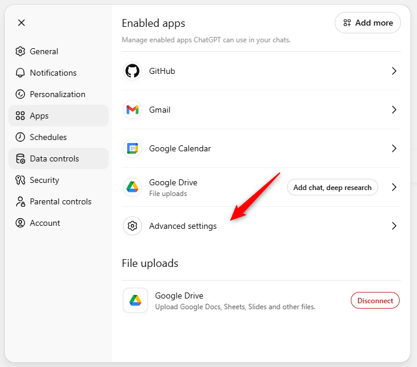
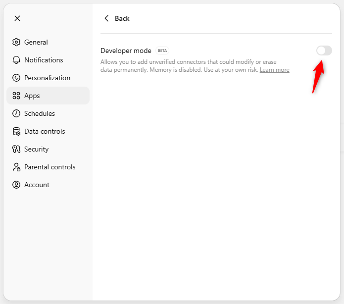
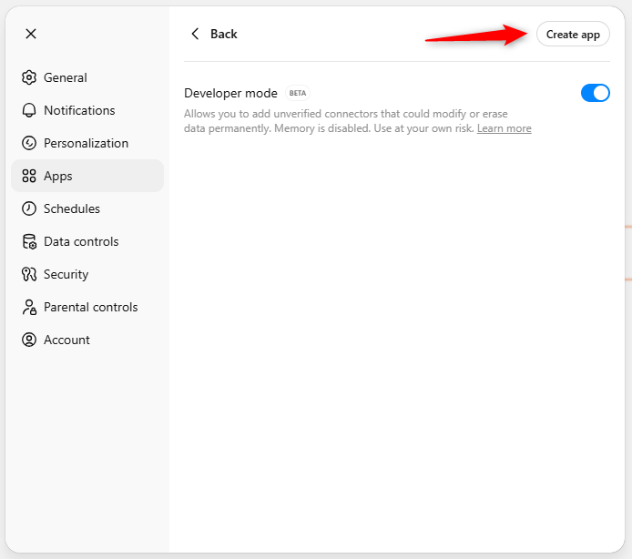
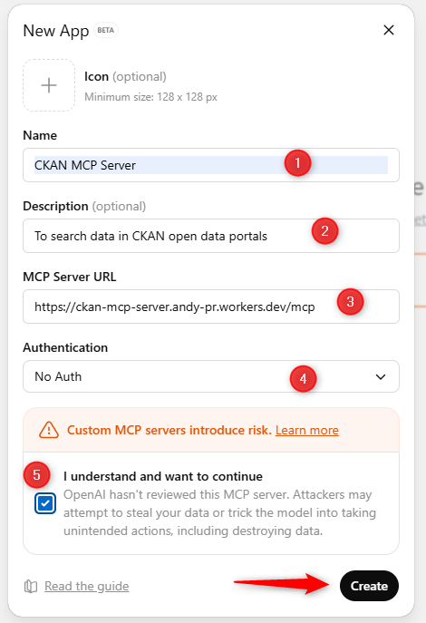
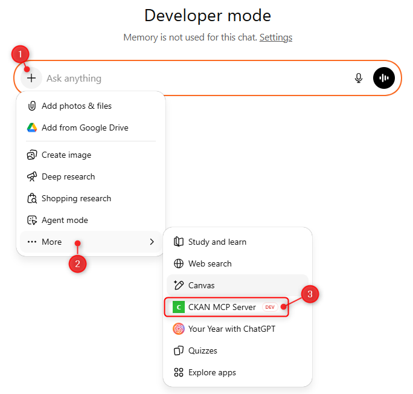
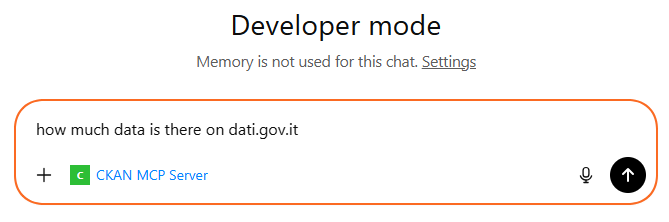
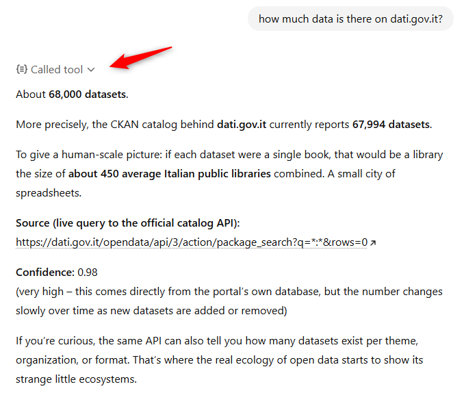

# Set up the CKAN MCP Server in ChatGPT (Web)

This guide uses the public demo server, which has a limit of 100,000 calls per day shared quota across all users of this endpoint. For reliable usage, it is recommended to install the CKAN MCP Server on your own machine.

This guide walks you through enabling Developer mode, creating the CKAN MCP Server app, and using it inside a chat.

## 1) Open Settings

Open the profile menu and click **Settings**.

## 2) Go to Apps → Advanced settings

In Settings, select **Apps**, then click **Advanced settings**.

## 3) Enable Developer mode

Turn on **Developer mode**.

## 4) Create a new app

Click **Create app** in the top-right.

## 5) Fill in the MCP server details

Complete the form:

- **Name:** CKAN MCP Server
- **Description:** To search data in CKAN open data portals
- **MCP Server URL:** `https://ckan-mcp-server.andy-pr.workers.dev/mcp`
- **Authentication:** No Auth
- Check the confirmation box, then click **Create**.

## 6) Start a chat and enable the app

In a new chat, click **+**, then **More**, and select **CKAN MCP Server**.

## 7) Ask a CKAN question

Type your question. You will see the CKAN MCP Server badge under the input.

## 8) View the tool output

ChatGPT will call the tool and return a response, often including a source link to the CKAN API.

