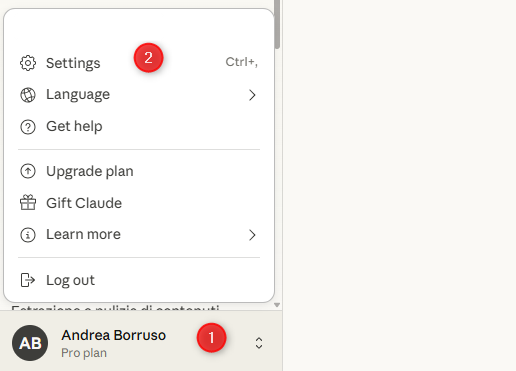
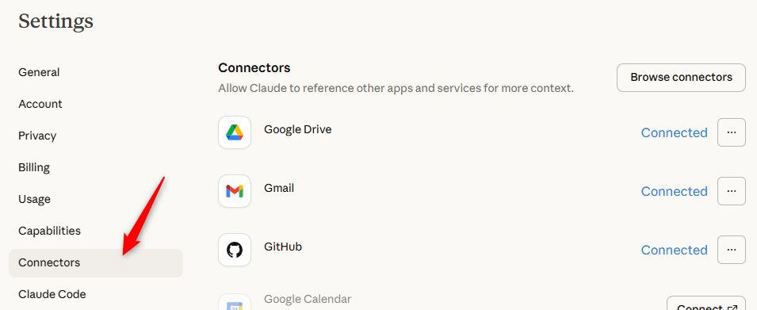
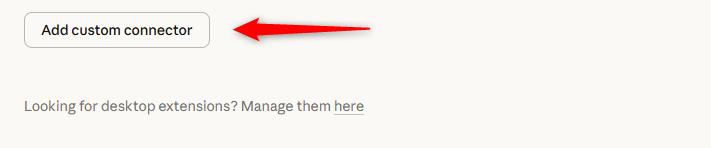
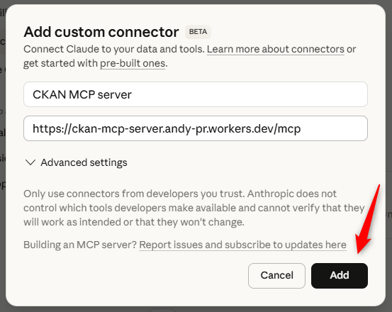
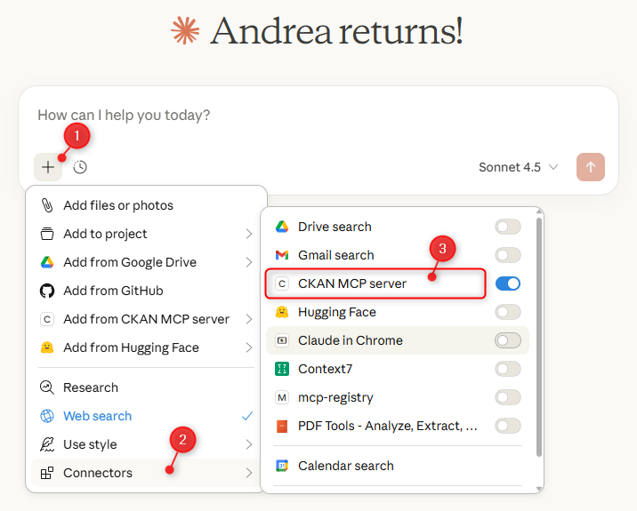
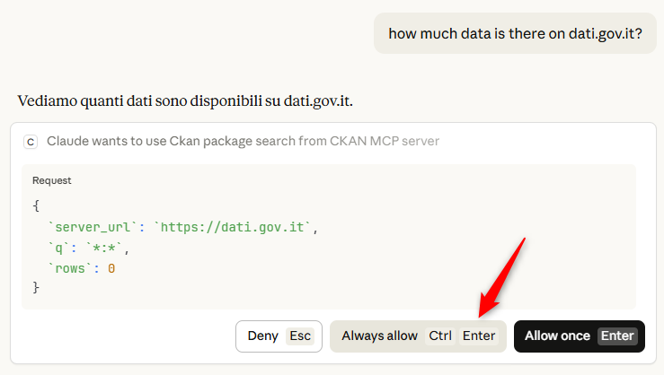
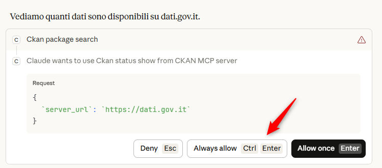
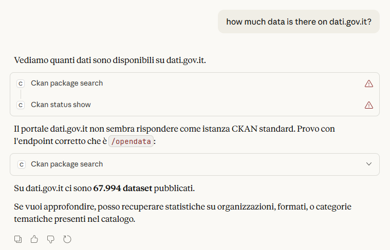
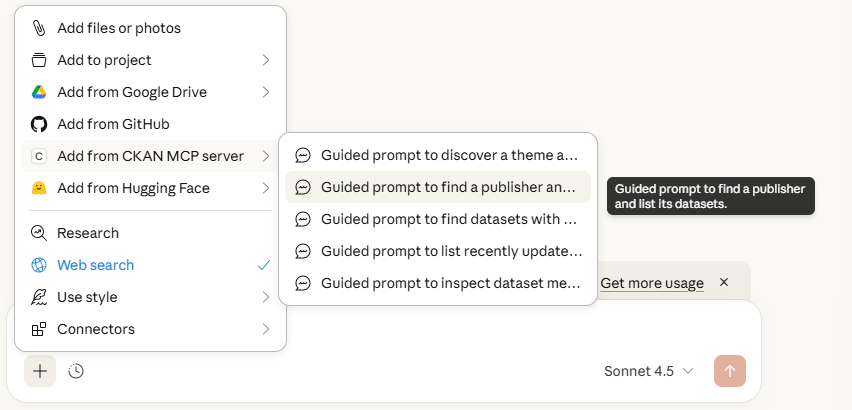
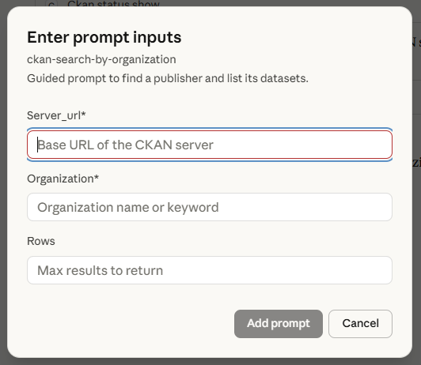

# Set up the CKAN MCP Server in Claude (Web)

This guide uses the public demo server, which has a limit of 100,000 calls per day shared quota across all users of this endpoint. For reliable usage, it is recommended to install the CKAN MCP Server on your own machine.

This guide shows how to add the CKAN MCP Server as a custom connector in Claude and use it in a chat.

## 1) Open Settings

Open the profile menu and click **Settings**.

## 2) Go to Connectors

In Settings, select **Connectors**.

## 3) Add a custom connector

Scroll down and click **Add custom connector**.

## 4) Fill in the connector details

Enter the connector name and MCP server URL, then click **Add**.

- **Name:** CKAN MCP server
- **MCP Server URL:** `https://ckan-mcp-server.andy-pr.workers.dev/mcp`

## 5) Enable the connector in chat

Open a new chat, click **+**, then **Connectors**, and turn on **CKAN MCP server**.

## 6) Ask a CKAN question

Type your question and send it.

## 7) Allow tool usage

When Claude asks to use the CKAN MCP Server tools, click **Always allow** (or **Allow once**).

## 8) Approve additional tool calls

If Claude needs a follow-up tool call, approve it the same way.

## 9) View the results

Claude will return the answer after running the tool(s).

---

## Guided prompts

Claude includes **Guided prompts** for the CKAN MCP Server, which provide ready-made examples to get started quickly.

Open the **+** menu, choose **Add from CKAN MCP server**, and pick a guided prompt from the list.

Fill in the required fields (for example, the CKAN server URL and organization), then add the prompt.

